# InfoGAN
## InfoGAN Architecture 

Tensorlayer implementation of [InfoGAN: Interpretable Representation Learning by Information Maximizing Generative Adversarial Nets](https://arxiv.org/abs/1606.03657).

<div align="center">
	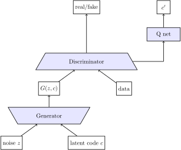
</div>

## Results

### MNIST

#### Manipulating the First Continuous Latent Code

Changing  will rotate the digits:

<div align="center">
	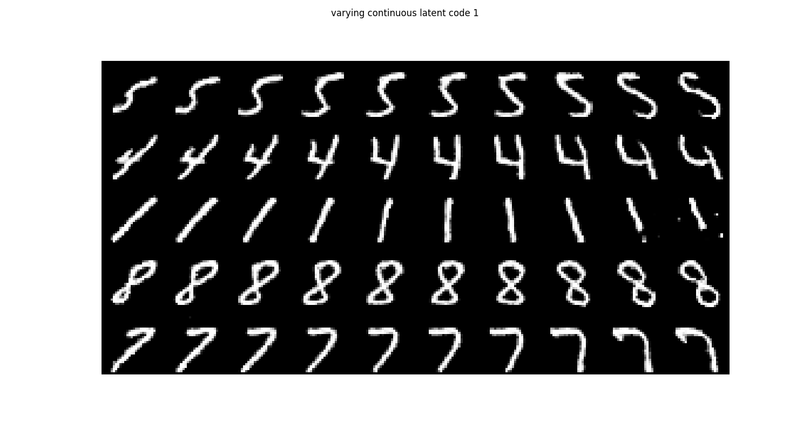
</div>

#### Manipulating the Second Continuous Latent Code

Changing  will change the width of the digits:

<div align="center">
	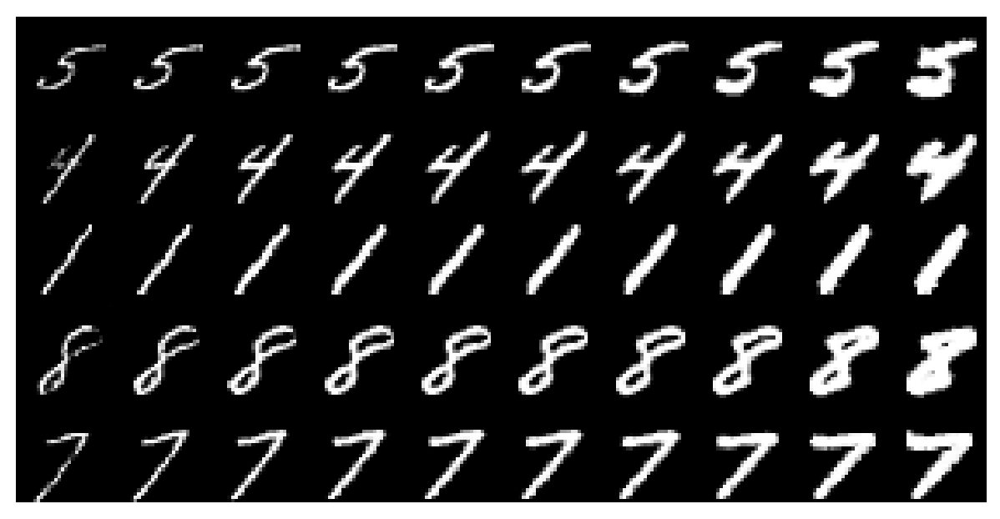
</div>

#### Manipulating the Discrete Latent Code (Categorical)

Changing  will change the type of digits:

<div align="center">
	
</div>

#### Random Generation and Loss Plot

<div align="center">
	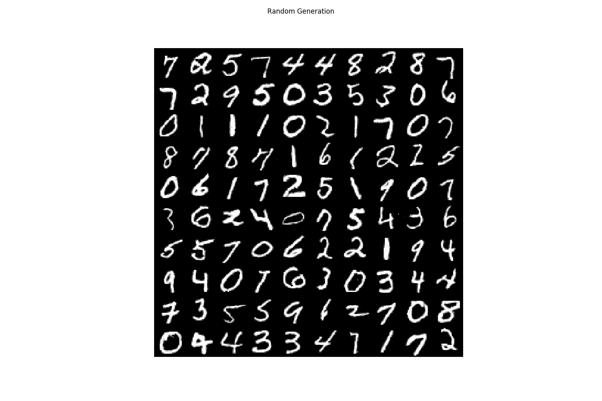
</div>

G_loss increases steadily after a sufficient number of iterations, showing the discriminator is getting stronger and stronger and indicating the end of training.

<div align="center">
	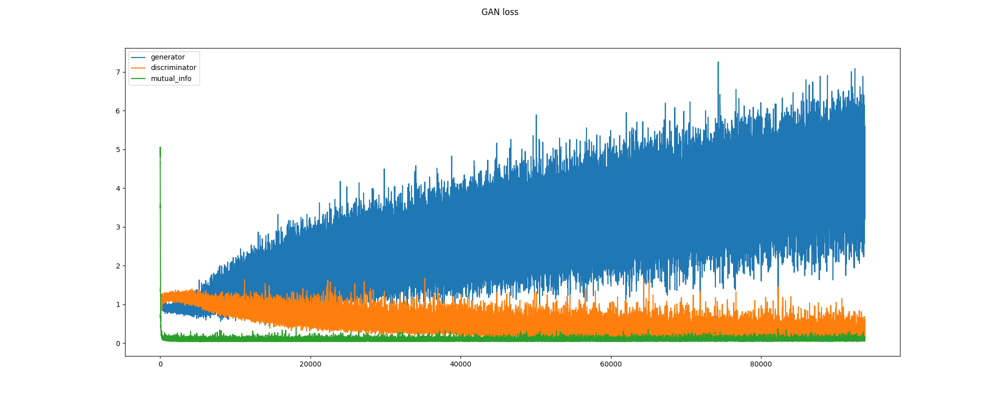
</div>

### CelebA

#### Manipulating Discrete Latent Code

Azimuth (pose):

<div align="center">
	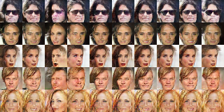
</div>

Presence or absence of glasses:

<div align="center">
	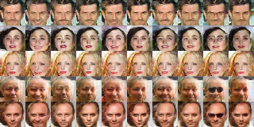
</div>

Hair color:

<div align="center">
	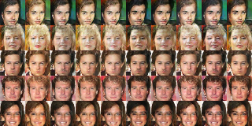
</div>

Hair quantity:

<div align="center">
	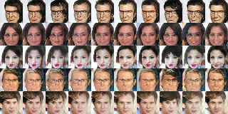
</div>

Lighting:

<div align="center">
	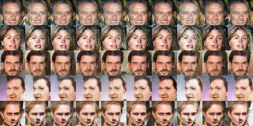
</div>

### Faces

The code is based on a dataset in the format of .png.
However, due to my lack of knowledge on 3D morphable models(3DMM) and lack of time, I didn't figure out how to convert the Basel Face Model to the format of .png. I trained tht network on a relatively small dataset [3D Face Scans & Renderings](https://faces.dmi.unibas.ch/bfm/main.php?nav=1-0&id=basel_face_model).

#### Loss Plot

<div align="center">
	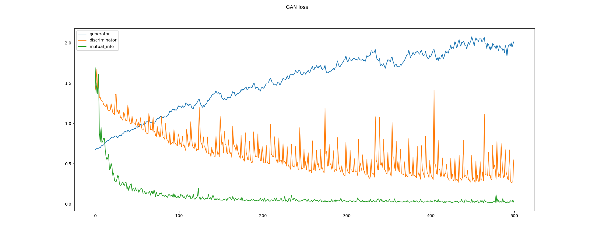
</div>

## Run

#### MNIST

* Start training using ```python train.py```; this will automatically download the dataset.
* To see the results, execute ```python test.py``` and **input the number of your saved model**.
* Feel free to manipulate the parameters in ```test.py```.

#### CelebA

+ Set your image folder in `config.py`.
+ Some links for the datasets:
	+ [CelebA](https://drive.google.com/drive/folders/0B7EVK8r0v71pWEZsZE9oNnFzTm8)
+ Start training.

```
python train.py
```

#### Faces

* Set your image folder in `config.py`. Note that BFM 2009 is provided in the format of .mat. Before you start training, convert it to the format of .png first.
* A link for BFM 2009:
	* [Basel Face Model](https://faces.dmi.unibas.ch/bfm/main.php?nav=1-0&id=basel_face_model)
* Start training by typing ```python train.py```

## References

1. [InfoGAN: Interpretable Representation Learning by Information Maximizing Generative Adversarial Nets](https://arxiv.org/abs/1606.03657)
2. [Large-scale CelebFaces Attributes (CelebA) Dataset](http://mmlab.ie.cuhk.edu.hk/projects/CelebA.html)
3. [THE MNIST DATABASE of handwritten digits](http://yann.lecun.com/exdb/mnist/)

## Authors

+ [李舒辰 (@lisc55)](https://github.com/lisc55): The experiment on CelebA.
+ [王畅 (@wangchang327)](https://github.com/wangchang327): The experiment on MNIST.
+ [竺沈涵 (@zshCuanNi)](https://github.com/zshCuanNi): The experiment on Faces.

